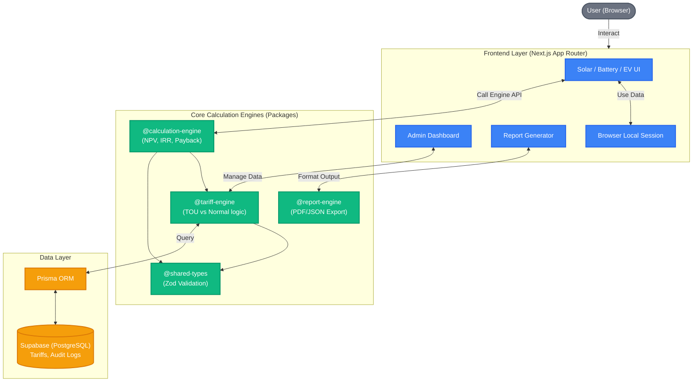

# Thai Energy Planner - Architecture & User Guide

เอกสารชุดนี้จัดทำขึ้นเพื่อใช้เป็นข้อมูลประกอบการนำเสนอ (Presentation) โดยแบ่งออกเป็น 2 ส่วนหลักคือ **แผนผังโครงสร้างระบบ (System Architecture)** ที่แสดงถึงความซับซ้อนและการออกแบบระดับสูง และ **คู่มือการใช้งาน (Feature Walkthrough)** สำหรับอธิบายทุกฟังก์ชันในระบบครับ

---

## ส่วนที่ 1: แผนผังโครงสร้างระบบ (System Architecture)

ระบบนี้ถูกออกแบบมาในลักษณะ **Monorepo** เพื่อรองรับการขยายตัว (Scalability) และแยกส่วนการประมวลผลตรรกะ (Business Logic) ออกจากส่วนแสดงผล (UI) อย่างเด็ดขาด ซึ่งเป็นแนวทางปฏิบัติที่ดีที่สุด (Best Practice) ระดับ Enterprise

### คำอธิบายโครงสร้าง (สคริปต์สำหรับนำเสนอ)

- **ทำไมต้องแยก Engine ออกจาก UI?**
  การเอาสูตรคำนวณค่าไฟและสูตรการเงิน (NPV/IRR) ไปเขียนรวมไว้ในหน้าเว็บ (React Components) จะทำให้โค้ดอ่านยากและมีโอกาสบั๊กสูง เราจึงแยกสูตรทั้งหมดออกเป็น Package อิสระ (`@calculation-engine`) ทำให้สามารถเขียน Unit Test ตรวจสอบความถูกต้องของสูตรคณิตศาสตร์กว่า 100+ เคสได้อย่างแม่นยำ โดยไม่ต้องเปิดหน้าเว็บเลย
- **Stateless vs Stateful:**
  ข้อมูลที่เป็นความลับของผู้ใช้ เช่น บิลค่าไฟ จะถูกเก็บไว้แค่ใน Local Session ของ Browser (ฝั่ง Frontend) เท่านั้น ไม่ถูกส่งไปเก็บในฐานข้อมูลกลาง เพื่อความปลอดภัยและ Privacy สูงสุด (ฐานข้อมูลจะเก็บแค่เรทค่าไฟกลางจากรัฐบาลเท่านั้น)

---

## ส่วนที่ 2: การใช้งานเว็บทุกฟังก์ชัน (Feature Walkthrough)

เพื่อให้การนำเสนอลื่นไหล นี่คือลำดับฟังก์ชันและวิธีอธิบายการทำงานของแต่ละหน้าครับ:

### 1. หน้า Admin (`/admin`) - ระบบหลังบ้าน

- **หน้าที่:** เป็นหน้าสำหรับผู้ดูแลระบบ เพื่อปรับปรุง "เรทค่าไฟกลาง (Tariffs)" เช่น อัปเดตค่า Ft, ค่าบริการรายเดือน, หรือเรท TOU/Normal ตามประกาศของการไฟฟ้า
- **จุดเด่นนำเสนอ:** เราไม่ได้ Hardcode ค่าไฟฝังไว้ในโค้ด แต่ดึงจาก Database แบบ Dynamic ดังนั้นถ้ารัฐบาลเปลี่ยนเรทค่าไฟ ระบบเราสามารถอัปเดตใช้งานต่อได้ทันทีโดยไม่ต้องแก้โค้ด

### 2. หน้า Current Bill Analysis (`/analysis/load-data`) - จุดเริ่มต้นของผู้ใช้

- **หน้าที่:** ให้ผู้ใช้นำบิลค่าไฟเดือนล่าสุดมาเปิดดู และกรอกตัวเลขหน่วยการใช้ไฟเข้าไป หรือจะใช้วิธีระบุเครื่องใช้ไฟฟ้าหลักๆ (Appliance Builder) ก็ได้
- **จุดเด่นนำเสนอ:** ระบบจะจำลองพฤติกรรมการใช้ไฟ (Load Profile) ออกมาเป็นรายชั่วโมงแบบอัจฉริยะ ว่าบ้านหลังนี้ใช้ไฟตอนกลางวันหรือกลางคืนมากกว่ากัน เพื่อเป็นฐานข้อมูลในการคำนวณขั้นต่อไป

### 3. หน้า Scenario Comparison (`/analysis/scenarios`) - ปกติ vs TOU

- **หน้าที่:** นำพฤติกรรมการใช้ไฟจากข้อ 2 มาเทียบให้ดูชัดๆ เลยว่า ถ้าเปลี่ยนมิเตอร์จาก "แบบอัตราก้าวหน้าปกติ" ไปเป็น "แบบ TOU (กลางวันแพง กลางคืนถูก)" บิลค่าไฟจะถูกลงหรือแพงขึ้น
- **จุดเด่นนำเสนอ:** ระบบทำหน้าที่เป็น **Decision Support** (ช่วยตัดสินใจ) อย่างแท้จริง โดยมีคำแนะนำบอกเลยว่า "คุณควรเปลี่ยนเป็น TOU หรือไม่" หรือ "ต้องย้ายการใช้ไฟไปตอนกลางคืนกี่เปอร์เซ็นต์ถึงจะคุ้ม"

### 4. หน้า Solar Analysis (`/analysis/solar`) - ประเมินโซลาร์เซลล์ 🌟 (ไฮไลท์)

- **หน้าที่:** ประเมินว่าถ้าติดโซลาร์เซลล์ขนาดต่างๆ (เช่น 3kW, 5kW) จะช่วยลดค่าไฟได้เท่าไหร่
- **จุดเด่นนำเสนอ:** หน้านี้คือหัวใจสำคัญ เพราะระบบจะดึง Engine ทางการเงินมาคำนวณ **CAPEX (เงินลงทุน)**, **NPV (มูลค่าปัจจุบันสุทธิ)** และ **IRR (อัตราผลตอบแทน)** พร้อมแนะนำ "ขนาดที่คุ้มค่าที่สุด (Best Payback)" ให้แบบอัตโนมัติ โดยอิงจากการใช้ไฟตอนกลางวันจริงๆ ของบ้านหลังนั้น

### 5. หน้า Battery & EV (`/analysis/battery`, `/analysis/ev`) - ส่วนต่อขยาย

- **หน้าที่:** ประเมินความคุ้มค่ากรณีติดแบตเตอรี่กักเก็บพลังงาน (BESS) หรือซื้อรถยนต์ไฟฟ้า (EV)
- **จุดเด่นนำเสนอ:** แสดงให้เห็นวิสัยทัศน์ของแอปว่ารองรับเทรนด์พลังงานสะอาดแบบครบวงจร (Ecosystem) การมี EV อาจทำให้คุ้มที่จะเปลี่ยนเป็น TOU มากขึ้น เป็นต้น

### 6. หน้า Reports (`/analysis/reports`) - สรุปผล

- **หน้าที่:** รวบรวมผลลัพธ์จากการวิเคราะห์ทั้งหมดมาออกเป็น "รายงานสรุป" หน้าเดียวจบ
- **จุดเด่นนำเสนอ:** มี Disclaimer ชัดเจนว่านี่คือ "ข้อมูลประเมินเบื้องต้นเพื่อประกอบการตัดสินใจ" ช่วยเสริมความน่าเชื่อถือระดับมืออาชีพ ผู้ใช้สามารถใช้ข้อมูลนี้ไปคุยกับผู้รับเหมาติดตั้งโซลาร์เซลล์ต่อได้เลย
